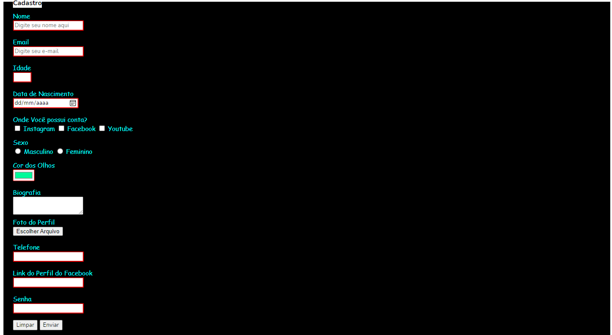

Collored Formulary

> Resultado de um formulário básico feito em HTML estilizado com CSS.

### Ajustes e melhorias

O projeto já está concluído:

- [x] Criação do HTML
- [x] Criação do CSS
:grinning:

<table>
  <tr>
    <td align="center">
      <a href="#">
         
        
          <b>Mario Pereira</b>
        
      </a>
    </td>
  </tr>
</table>
